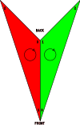

# Boids in MonoGame

I built this as my first foray into making things with MonoGame, it's my go-to
project for something new as the elements involved are very simple, basically
just some vector math and drawing triangles onto the screen. Plus I've done it
before in other languages / frameworks / engines.

## Boids

I won't go too deep into the details here, you can read about the original boids
simulation by Craig Reynolds [here](https://cs.stanford.edu/people/eroberts/courses/soco/projects/2008-09/modeling-natural-systems/boids.html).

There is an excellent implementation walkthrough (in Unity) by Sebastian Lague
on YouTube [here](https://www.youtube.com/watch?v=bqtqltqcQhw).

## Setup

To set this repo up I basically followed the MonoGame getting started docs which
you can find [here](https://docs.monogame.net/articles/getting_started/index.html). I'm using Windows 11 so I did the follwing:

- Download and install the .NET 8 SDK (specifically I have 8.0.401)
- Install MonoGame templates with this powershell command

`dotnet new install MonoGame.Templates.CSharp`

- Run the command to setup a new MonoGame project

`dotnet new mgdesktopgl`

## Running

Just type this command in a powershell terminal in the root directory

`dotnet run`

## Project Architecture

The architecture is very simple, it's based on a previous implementation I did.

There's a Boid class which represents a single boid; it has properties for the
position and velocity of the boid, and contains all the logic for updating the
position and velocity based on the 3 rules (separation, cohesion, alignment).

The main game loop is just managed by Boids.cs, which implements a child class
of the main Game class required by MonoGame. This class creates the boids and
updates them all on every frame, and contains the code for drawing them to the
screen.

## Rendering

One of the elements that's new to me with this implementation is how the boids
are drawn. Previously I would use built in shapes or game engines which do most
of it for you.

Here each triangle is drawn to the screen individually (although we can batch
multiple draws together). The way I've used this is as follows:

- `_boidVertices` sets the standard shape of a boid by defining the positions of
  its vertices. See below for more detail on this
- `_vertexBuffer` is a buffer we use to send data to the GPU, because all the
  boids will have the same shape we can do this once in the initialisation and
  then use different projection matrices to control where on the screen the
  shape is actually drawn
- `_basicEffect` is also created during initialisation and defines the effects
  used for drawing which in this case includes the camera definition we're
  assuming, the colour to use when drawing, and a projection matrix to apply
- When drawing, we update the projection matrix of the effect before drawing
  each individual boid in order to rotate the shape to match the boid's heading
  (purely defined by velocity) and translate it to the boid's position

### Vertex winding

Notes on the contents of `_boidVertices`:

- The default orientation points down and is then rotated according to the
  heading of the boid. Even though in my head the default orientation would
  point up I don't have the maths worked out to get that to work
- The vertices are defined in two sets of three, one for each triangle that
  makes up the final shape
- The order of the vertices within a triangle is important, in this case they
  are defined in clockwise order. The order (known as winding order) tells the
  renderer which direction the triangle faces so that in 3D applications it can
  ignore triangles facing away from the camera (backface culling).
  [See also](https://www.khronos.org/opengl/wiki/Face_Culling).

